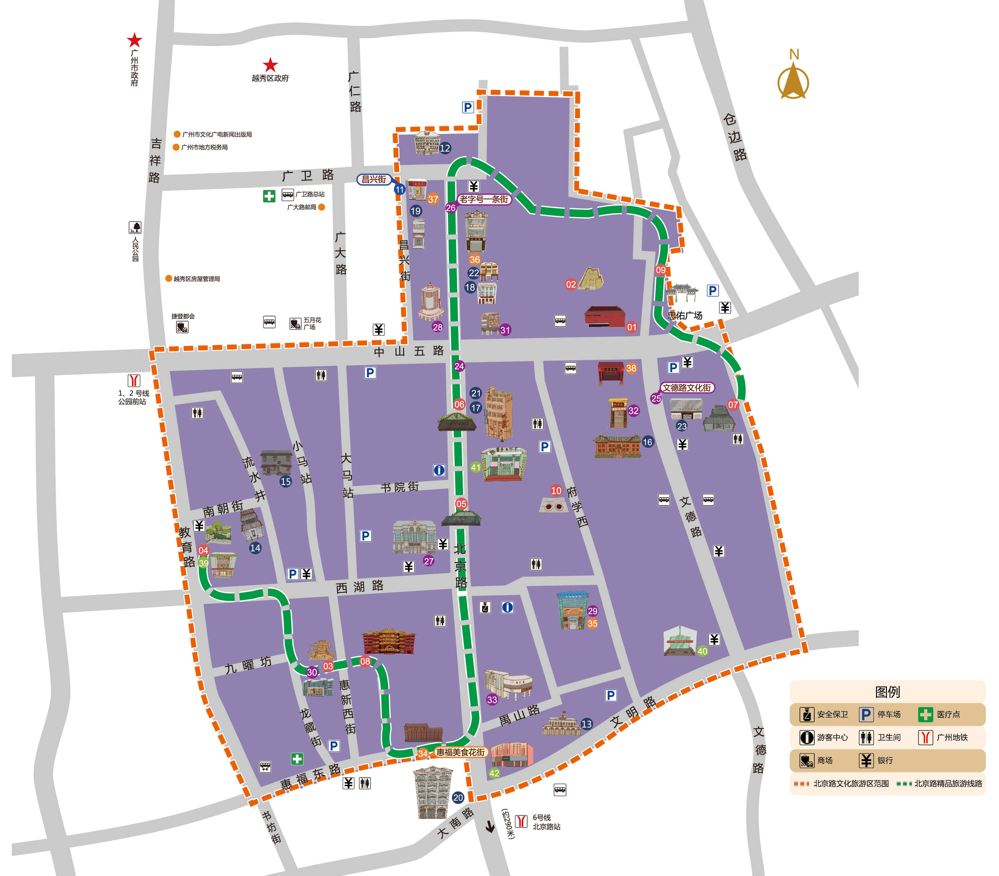

# 缩放

```Html
<div class="mapZoom">
	<div class="mapInfo">
		<!--图片-->
		
					
		<!--标注容器-->
		<div class="mapMark"></div> 
	</div>
				
	<!--弹窗容器-->
	<div class="zoomMask">
		
		<div class="zoomMask_head">
			<p class="zoomColumn"></p>
			<p class="zoomHeading">
				<span class="zoomId"></span>
				<span class="zoomTitle"></span>
			</p>
		</div>
		<div class="zoomMask_content">
			<p class="zoomTxt"></p>
		</div>
		<div class="zoomMaskClose"></div>
	</div>
				
	<!--控制缩放、显示缩放比例控件-->
	<span class="zoom_in zoom_btn">+</span>
	<span class="zoom_out zoom_btn">-</span>
	<span class="zoom_zero zoom_btn">1:1</span>
	<span class="zoom_fit zoom_btn"></span>
	<span class="zoom_status"></span>
				
	<!--loading-->
	<span class="zoomLoading"></span>
</div>
```

```JavaScript
var data = [
  {
    "id": "...", //标记
		"x": "...", //位于原图的X轴坐标（单位：PX）
		"y": "...", //位于原图的Y轴坐标
		"column": "...", //所属栏目
		"title": "...", //标题
		"txt": "...", //简介
		"color": "...", //标注颜色
		"img": "..." //图片地址
  }
  ...
];
var zoom = new ZoomPlugin({
	el: ".mapZoom",
	label: true, //是否启用标注
	initScaleSize: 55, //初始显示缩放的大小  注：如果初始比例小于原图位于容器的比例  则改成最小比例
	maxScaleSize: 300, //最大缩放比例
	proportion: 5, //每次增减的比例
	data: data //图片上标注
});
```